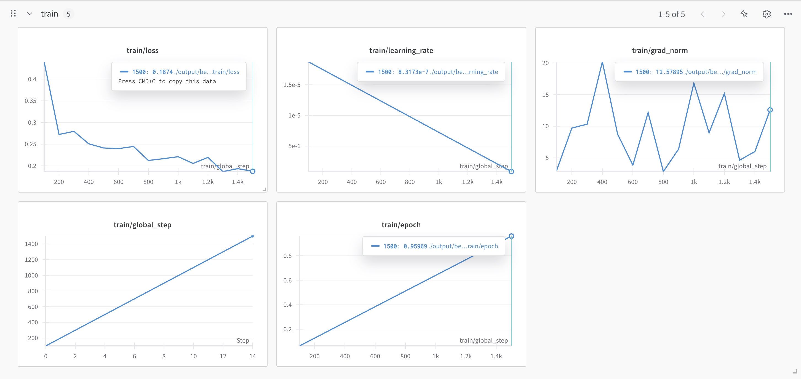
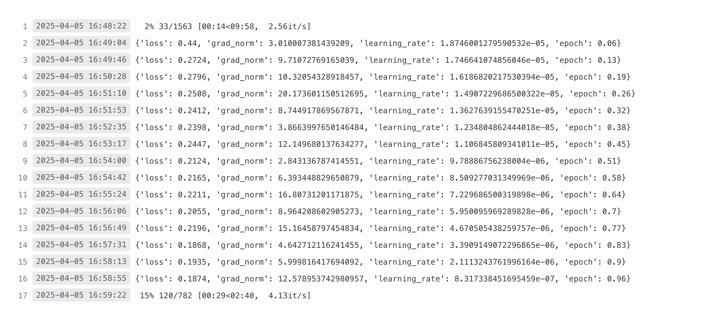
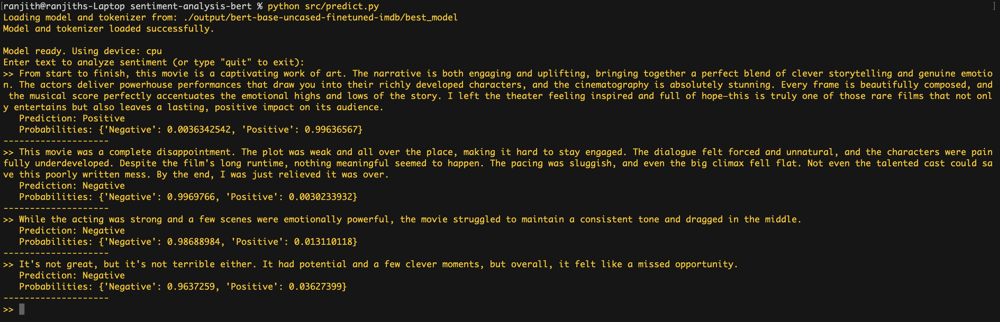

## Setup

1.  **Clone the repository:**
    ```bash
    git clone <https://github.com/r4njith-kali/sentiment-analysis-bert> 
    cd sentiment-analysis-bert
    ```

2.  **Create and activate a virtual environment:**
    *   Using `venv`:
        ```bash
        python -m venv venv
        # On Windows: .\venv\Scripts\activate
        # On macOS/Linux: source venv/bin/activate
        ```
    *   Using `conda`:
        ```bash
        conda create -n sentiment_env python=3.9
        conda activate sentiment_env
        ```

3.  **Install dependencies:**
    ```bash
    pip install -r requirements.txt
    ```
    *(Note: If using CUDA/GPU, ensure you install the correct PyTorch version for your CUDA toolkit. See [PyTorch Get Started](https://pytorch.org/get-started/locally/))*

## Data

This project uses the [IMDb Large Movie Review Dataset](https://huggingface.co/datasets/imdb). The dataset is automatically downloaded and cached by the Hugging Face `datasets` library the first time you run the `data_loader.py`, `train.py`, or `run_evaluation.py` script.

No manual data download is required. The downloaded data is typically stored in `~/.cache/huggingface/datasets/`.

## Usage

### 1. Training

**IMPORTANT:** Training BERT models requires significant computational resources, particularly GPU memory and time. Running `train.py` on a standard CPU will be extremely slow (potentially days). It is highly recommended to use a machine with a CUDA-enabled GPU (like Google Colab, Kaggle Kernels, or a cloud VM).

*   **Modify Configuration (Optional):** Adjust parameters like `NUM_EPOCHS`, `LEARNING_RATE`, `TRAIN_BATCH_SIZE` in `src/config.py` as needed.
*   **Run Training Script:**
    ```bash
    python src/train.py
    ```
*   **Output:** The script will:
    *   Load and preprocess the data.
    *   Load the `bert-base-uncased` model.
    *   Fine-tune the model using the parameters in `src/config.py`.
    *   Log training progress and evaluate on the test set after each epoch.
    *   Save checkpoints and the best performing model (based on accuracy) to the directory specified in `config.OUTPUT_DIR_BASE` (e.g., `./output/bert-base-uncased-finetuned-imdb/best_model/`).

### 2. Evaluation

This script loads the fine-tuned model saved during training and evaluates its performance on the test set.

*   **Prerequisite:** Ensure training has completed and the `best_model` directory exists within the `output/` folder. If you trained on Colab/elsewhere, download the `output` directory and place it in your project root.
*   **Run Evaluation Script:**
    ```bash
    python src/run_evaluation.py
    ```
*   **Output:** Prints the evaluation metrics (loss, accuracy, etc.) achieved by the loaded fine-tuned model on the test set.

### 3. Prediction

This script allows you to interactively get sentiment predictions for custom text inputs using the fine-tuned model.

*   **Prerequisite:** Ensure training has completed and the `best_model` directory exists within the `output/` folder.
*   **Run Prediction Script:**
    ```bash
    python src/predict.py
    ```
*   **Interaction:** The script will load the model and prompt you to enter text. Type a sentence or paragraph and press Enter to see the predicted sentiment ("Positive" or "Negative") and probabilities. Type `quit` to exit.

## Results

After fine-tuning `bert-base-uncased` for **1 epoch** on the IMDb training set, the model achieved the following performance on the test set:

*   **Accuracy:** ~0.9377 (or **93.77%**)
*   **Loss:** ~0.1770

*(Evaluation performed using the test split of the IMDb dataset)*

## 📊 Training Progress



## 🧠 Model Summary



🚀 Model Performance – Sample Predictions
Below are sample inputs and the corresponding predictions made by the fine-tuned BERT sentiment classifier. These examples were manually tested through the terminal interface.

Input Type	Review Snippet	Predicted Label	Confidence
✅ Positive	"From start to finish, this movie is a captivating work of art... I left the theater feeling inspired and full of hope."	Positive	99.64%
❌ Negative	"This movie was a complete disappointment... Not even the talented cast could save this poorly written mess."	Negative	99.70%
⚖️ Mixed	"While the acting was strong... the movie struggled to maintain a consistent tone."	Negative	98.69%
⚖️ Mixed	"It's not great, but it's not terrible either... overall, it felt like a missed opportunity."	Negative	96.37%



## Configuration

Key hyperparameters and paths can be modified in `src/config.py`:

*   `MODEL_NAME`: Base model identifier from Hugging Face Hub.
*   `DATASET_NAME`: Dataset identifier from Hugging Face Hub.
*   `MAX_LENGTH`: Maximum sequence length for tokenization.
*   `NUM_EPOCHS`, `TRAIN_BATCH_SIZE`, `EVAL_BATCH_SIZE`, `LEARNING_RATE`, etc.: Training hyperparameters.
*   `OUTPUT_DIR_BASE`, `LOGGING_DIR_BASE`: Base directories for saving outputs.

## Technology Stack

*   Python 3.x
*   PyTorch
*   Hugging Face `transformers`
*   Hugging Face `datasets`
*   Hugging Face `evaluate`
*   NumPy
*   Git
